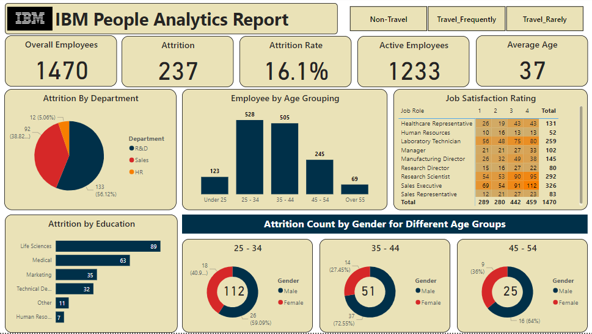

# HR-Analytics-Dashboard-PowerBI

Dashboard Preview (Image)

Welcome to the HR Analytics Dashboard project! This interactive dashboard was created using PowerBI and is designed to provide insights into various HR metrics and KPIs using a real-world HR dataset obtained from Kaggle, made available by IBM Data Scientist. The dashboard offers visualizations and data exploration capabilities that allow users to gain valuable insights into employee attrition, job satisfaction, and more.

### Table of Contents

- Overview
- Features
- Getting Started
- Dashboard Preview
- Usage

### Overview
This dashboard aims to analyze and visualize HR-related metrics and key performance indicators (KPIs) to help organizations better understand their workforce dynamics. By exploring data such as attrition count, attrition rate, job satisfaction ratings, and demographic information, users can identify trends and patterns that can inform decision-making.

### Features

- Attrition Analysis: Visualizations showcasing attrition count and attrition rate across different gender groups, departments, and educational qualifications.
- Job Satisfaction Insights: Explore job satisfaction ratings across various professions and age groups to understand employee contentment.
- Dynamic Data Exploration: Use interactive filters to slice and dice the data, gaining deeper insights through personalized explorations.
- Custom Measures: The dashboard includes custom measures created using DAX (Data Analysis Expressions) to derive calculated values and enhance data analysis.
- Online Access: The dashboard is published to the PowerBI Service, allowing remote users to interact with and explore the data without needing PowerBI desktop.

### Getting Started
To access and interact with the HR Analytics Dashboard, follow these steps:

- Visit the PowerBI Service website.
- Log in using your Microsoft 365 developer account.
- Locate the shared dashboard titled "HR Analytics Dashboard" and click on it to start exploring the data visualizations.

### Dashboard Preview

Explore the live dashboard on the PowerBI Service to experience the interactive features and visualize the HR analytics.

### Usage

The dashboard is designed to be user-friendly and intuitive. Follow these steps to explore and interact with the data:

- Use the filters on the right-hand side to select specific gender groups, departments, educational qualifications, professions, and age groups.
- Observe how the visualizations dynamically adjust based on your selections, providing instant insights.
- Hover over different data points to see additional details and tooltips.
- Take advantage of the custom measures to understand complex metrics.
